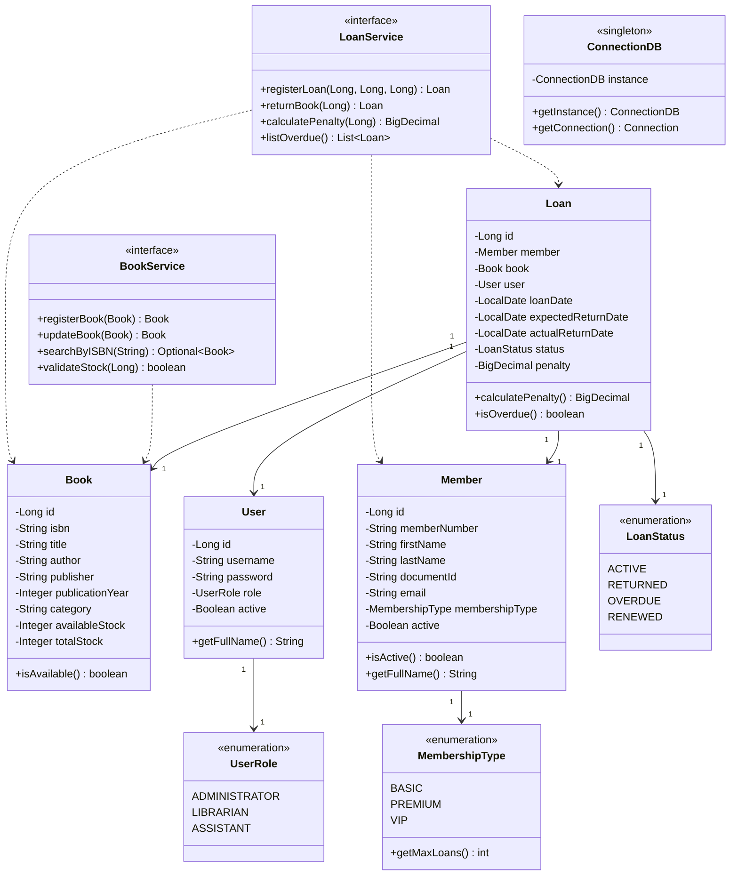

# LibroNova - Library Management System


## 📋 Table of Contents

- [Overview](#overview)
- [Features](#features)
- [System Architecture](#system-architecture)
- [Prerequisites](#prerequisites)
- [Installation and Setup](#installation-and-setup)
- [Configuration](#configuration)
- [Running the Application](#running-the-application)
- [Testing](#testing)
- [Project Structure](#project-structure)
- [UML Diagrams](#uml-diagrams)
- [Screenshots](#screenshots)
- [API Documentation](#api-documentation)
- [Contributing](#contributing)
- [License](#license)

---

## 🎯 Overview

**LibroNova** is a comprehensive library management system designed to streamline book cataloging, member management, and loan operations for libraries. Built with Java 17 and JavaFX, it implements a layered architecture pattern with clean separation of concerns.

### Key Objectives

- Manage book inventory with ISBN validation
- Handle member registrations with different membership tiers (BASIC, PREMIUM, VIP)
- Process book loans and returns with automatic penalty calculation
- Enforce business rules (stock validation, active member verification)
- Generate CSV reports for catalog and overdue loans
- Maintain activity logs for auditing

---

## ✨ Features

### 📚 Book Management
- ✅ Register new books with unique ISBN validation
- ✅ Update book information
- ✅ Search by ISBN, title, or author
- ✅ Track available and total stock
- ✅ Prevent duplicate ISBN entries

### 👥 Member Management
- ✅ Register members with three membership types
- ✅ Activate/deactivate member accounts
- ✅ Search by member number or document ID
- ✅ Membership limits: BASIC (3 loans), PREMIUM (5 loans), VIP (10 loans)

### 📖 Loan Management
- ✅ Register loans with transaction support
- ✅ Process returns with automatic penalty calculation
- ✅ Renew active loans
- ✅ Track overdue loans
- ✅ Calculate penalties: $1.50 per day overdue (configurable)

### 📊 Reports & Exports
- ✅ Export book catalog to CSV
- ✅ Export overdue loans to CSV
- ✅ Generate loan reports by date range
- ✅ Activity logging to file

### 🔐 User Management & Roles
- ✅ Three user roles: ADMINISTRATOR, LIBRARIAN, ASSISTANT
- ✅ Role-based access control
- ✅ User authentication

---

## 🏗️ System Architecture

### Layered Architecture Pattern

```
┌─────────────────────────────────────┐
│     Presentation Layer (UI)         │
│        JavaFX Controllers           │
└──────────────┬──────────────────────┘
               │
┌──────────────▼──────────────────────┐
│       Service Layer (Business)      │
│    Business Logic & Validations     │
└──────────────┬──────────────────────┘
               │
┌──────────────▼──────────────────────┐
│     Repository Layer (Data Access)  │
│      JDBC Implementation            │
└──────────────┬──────────────────────┘
               │
┌──────────────▼──────────────────────┐
│       Infrastructure Layer          │
│  ConnectionDB (Singleton Pattern)   │
└─────────────────────────────────────┘
```

### Design Patterns Used

- **Singleton Pattern**: Database connection management (ConnectionDB, ConfigProperties)
- **Repository Pattern**: Data access abstraction
- **Dependency Injection**: Service layer dependencies
- **DTO Pattern**: Data transfer between layers

---

## 📋 Prerequisites

### Required Software

| Software | Version | Purpose |
|----------|---------|---------|
| **Java JDK** | 17 or higher | Runtime environment |
| **Apache Maven** | 3.8+ | Dependency management & build |
| **MySQL Server** | 8.0+ | Database server |
| **NetBeans IDE** | 27 (optional) | Development environment |
| **JavaFX SDK** | 17+ | UI framework |

### Verify Installation

```bash
# Check Java version
java -version
# Expected: java version "17.0.x"

# Check Maven version
mvn -version
# Expected: Apache Maven 3.8.x or higher

# Check MySQL status
mysql --version
# Expected: mysql Ver 8.0.x
```

---

## 🚀 Installation and Setup

### Step 1: Clone the Repository

```bash
git clone https://github.com/yourusername/libronova.git
cd libronova
```

### Step 2: Database Setup

1. **Start MySQL Server**

```bash
# Linux/Mac
sudo systemctl start mysql

# Windows
net start MySQL80
```

2. **Create Database and Tables**

```bash
mysql -u root -p < database/schema.sql
```

Or manually:

```sql
mysql -u root -p
```

```sql
CREATE DATABASE libronova;
USE libronova;

-- Run the complete schema.sql script
SOURCE path/to/schema.sql;
```

3. **Verify Database Creation**

```sql
SHOW TABLES;
```

Expected output:
```
+---------------------+
| Tables_in_libronova |
+---------------------+
| books               |
| loans               |
| members             |
| users               |
+---------------------+
```

### Step 3: Configure Database Connection

Edit `src/main/resources/config.properties`:

```properties
# Database Configuration
db.url=jdbc:mysql://localhost:3306/libronova?useSSL=false&serverTimezone=UTC
db.user=root
db.password=Qwe.123*
db.driver=com.mysql.cj.jdbc.Driver

# Business Rules
prestamo.dias.default=14
prestamo.multa.dia=1.50

# Logging
log.file=app.log
log.level=INFO
```

### Step 4: Build the Project

```bash
# Clean and compile
mvn clean compile

# Run tests
mvn test

# Package application
mvn package
```

---

## ⚙️ Configuration

### config.properties Options

| Property | Description | Default Value |
|----------|-------------|---------------|
| `db.url` | Database connection URL | `jdbc:mysql://localhost:3306/libronova` |
| `db.user` | Database username | `root` |
| `db.password` | Database password | `Qwe.123*` |
| `prestamo.dias.default` | Default loan period (days) | `14` |
| `prestamo.multa.dia` | Penalty per day overdue | `1.50` |
| `log.file` | Log file location | `app.log` |

### Membership Types Configuration

| Type | Max Loans | Description |
|------|-----------|-------------|
| BASIC | 3 | Standard membership |
| PREMIUM | 5 | Enhanced membership |
| VIP | 10 | Unlimited membership |

---

## ▶️ Running the Application

### Option 1: Run with Maven

```bash
mvn javafx:run
```

### Option 2: Run with NetBeans

1. Open the project in NetBeans 27
2. Right-click on the project
3. Select "Run"

### Option 3: Run JAR File

```bash
# After building with mvn package
java -jar target/libronova-1.0.0.jar
```

### Default Login Credentials

| Username | Password | Role |
|----------|----------|------|
| admin | admin123 | ADMINISTRATOR |
| maria | maria123 | LIBRARIAN |
| carlos | carlos123 | ASSISTANT |

---

## 🧪 Testing

### Run All Tests

```bash
mvn test
```

### Run Specific Test Class

```bash
mvn test -Dtest=LoanServiceTest
```

### Test Coverage

The project includes:
- **Unit Tests**: Business logic validation (stock, penalties, membership limits)
- **Integration Tests**: Database operations
- **Edge Case Tests**: Boundary conditions

### Test Results Location

```
target/surefire-reports/
├── TEST-LoanServiceTest.xml
├── TEST-BookServiceTest.xml
└── ...
```

---

## 📁 Project Structure

```
libronova/
├── src/
│   ├── main/
│   │   ├── java/
│   │   │   └── com/mycompany/libronova/
│   │   │       ├── domain/              # Domain entities
│   │   │       │   ├── Book.java
│   │   │       │   ├── Member.java
│   │   │       │   ├── User.java
│   │   │       │   └── Loan.java
│   │   │       │
│   │   │       ├── exceptions/          # Custom exceptions
│   │   │       │   ├── BookNotAvailableException.java
│   │   │       │   ├── InactiveMemberException.java
│   │   │       │   ├── DuplicateISBNException.java
│   │   │       │   └── LoanException.java
│   │   │       │
│   │   │       ├── repository/          # Repository interfaces
│   │   │       │   ├── BookRepository.java
│   │   │       │   ├── MemberRepository.java
│   │   │       │   ├── UserRepository.java
│   │   │       │   └── LoanRepository.java
│   │   │       │
│   │   │       ├── repository/jdbc/     # JDBC implementations
│   │   │       │   ├── BookRepositoryImpl.java
│   │   │       │   ├── MemberRepositoryImpl.java
│   │   │       │   ├── UserRepositoryImpl.java
│   │   │       │   └── LoanRepositoryImpl.java
│   │   │       │
│   │   │       ├── service/             # Service interfaces
│   │   │       │   ├── BookService.java
│   │   │       │   ├── MemberService.java
│   │   │       │   ├── LoanService.java
│   │   │       │   └── ReportService.java
│   │   │       │
│   │   │       ├── service/impl/        # Service implementations
│   │   │       │   ├── BookServiceImpl.java
│   │   │       │   ├── MemberServiceImpl.java
│   │   │       │   ├── LoanServiceImpl.java
│   │   │       │   └── ReportServiceImpl.java
│   │   │       │
│   │   │       ├── infra/config/        # Infrastructure
│   │   │       │   ├── ConnectionDB.java      # Singleton
│   │   │       │   ├── ConfigProperties.java  # Singleton
│   │   │       │   └── LoggerConfig.java
│   │   │       │
│   │   │       └── ui/                  # JavaFX UI
│   │   │           ├── MainApp.java
│   │   │           ├── controllers/
│   │   │           └── fxml/
│   │   │
│   │   └── resources/
│   │       ├── config.properties
│   │       └── fxml/
│   │
│   └── test/
│       └── java/
│           └── com/mycompany/libronova/
│               ├── LoanServiceTest.java
│               ├── BookServiceTest.java
│               └── MemberServiceTest.java
│
├── database/
│   └── schema.sql                       # Database schema
│
├── docs/
│   ├── diagrams/
│   └── screenshots/
│
├── exports/                             # CSV export directory
│
├── pom.xml                              # Maven configuration
├── README.md                            # This file
└── app.log                              # Application log file
```

---

## 📊 UML Diagrams

### Class Diagram



### Use Case Diagram

```mermaid
graph TB
    Admin[Administrator]
    Librarian[Librarian]
    Assistant[Assistant]
    
    subgraph "LibroNova System"
        UC1[Register Book]
        UC2[Update Book]
        UC3[Delete Book]
        UC4[Search Book]
        UC5[Register Member]
        UC6[Update Member]
        UC7[Activate/Deactivate Member]
        UC8[Register Loan]
        UC9[Return Book]
        UC10[Renew Loan]
        UC11[Calculate Penalty]
        UC12[View Overdue Loans]
        UC13[Export Catalog CSV]
        UC14[Export Overdue CSV]
        UC15[Manage Users]
        UC16[View Reports]
        
        UC17[Validate ISBN]
        UC18[Validate Stock]
        UC19[Validate Active Member]
        UC20[Log Activity]
    end
    
    Admin --> UC1
    Admin --> UC2
    Admin --> UC3
    Admin --> UC15
    
    Librarian --> UC1
    Librarian --> UC2
    Librarian --> UC5
    Librarian --> UC6
    Librarian --> UC7
    Librarian --> UC8
    Librarian --> UC9
    Librarian --> UC10
    Librarian --> UC13
    Librarian --> UC14
    
    Assistant --> UC4
    Assistant --> UC8
    Assistant --> UC9
    Assistant --> UC12
    
    UC1 -.->|include| UC17
    UC8 -.->|include| UC18
    UC8 -.->|include| UC19
    UC9 -.->|include| UC11
    UC1 -.->|include| UC20
    UC8 -.->|include| UC20
```



### Entity-Relationship Diagram

```
┌─────────────┐         ┌─────────────┐         ┌─────────────┐
│    USERS    │         │   MEMBERS   │         │    BOOKS    │
├─────────────┤         ├─────────────┤         ├─────────────┤
│ id (PK)     │         │ id (PK)     │         │ id (PK)     │
│ username    │         │ member_num  │         │ isbn (UQ)   │
│ password    │         │ first_name  │         │ title       │
│ first_name  │         │ last_name   │         │ author      │
│ last_name   │         │ document_id │         │ publisher   │
│ email       │         │ email       │         │ category    │
│ role        │         │ phone       │         │ avail_stock │
│ active      │         │ address     │         │ total_stock │
└──────┬──────┘         │ reg_date    │         └──────┬──────┘
       │                │ active      │                │
       │                │ membership  │                │
       │                └──────┬──────┘                │
       │                       │                       │
       │                       │                       │
       └───────────┐           │           ┌───────────┘
                   │           │           │
                   ▼           ▼           ▼
                ┌──────────────────────────────┐
                │          LOANS               │
                ├──────────────────────────────┤
                │ id (PK)                      │
                │ member_id (FK) ───────────┐  │
                │ book_id (FK) ─────────────┼──│
                │ user_id (FK) ─────────────┘  │
                │ loan_date                    │
                │ expected_return_date         │
                │ actual_return_date           │
                │ status                       │
                │ penalty                      │
                │ notes                        │
                └──────────────────────────────┘
```

---

## 📸 Screenshots

### Main Menu


*Main application menu with access to all modules*

### Book Management


*Register new books with ISBN validation*


*Search and filter books by various criteria*

### Member Management


*Register new library members with membership type selection*

### Loan Management


*Register new book loans with validation*


*Process book returns with automatic penalty calculation*

### Reports


*View and export overdue loans report*


*Export catalog and loan reports to CSV*

### JOptionPane Dialogs


*Success confirmation dialog*


*Error handling with user-friendly messages*


*Business rule validation messages*

---

## 📖 API Documentation

### BookService

```java
/**
 * Registers a new book in the system.
 * Validates ISBN uniqueness and stock values.
 */
Book registerBook(Book book) throws DuplicateISBNException, SQLException

/**
 * Updates an existing book.
 */
Book updateBook(Book book) throws SQLException

/**
 * Searches for a book by ISBN.
 */
Optional<Book> searchByISBN(String isbn) throws SQLException

/**
 * Validates if a book has available stock.
 */
boolean validateStock(Long bookId) throws SQLException
```

### LoanService

```java
/**
 * Registers a new loan with transaction support.
 * Validates member status, stock availability, and loan limits.
 */
Loan registerLoan(Long memberId, Long bookId, Long userId) 
    throws InactiveMemberException, BookNotAvailableException, LoanException, SQLException

/**
 * Processes book return and calculates penalties.
 */
Loan returnBook(Long loanId) throws LoanException, SQLException

/**
 * Calculates penalty for a specific loan.
 */
BigDecimal calculatePenalty(Long loanId) throws SQLException

/**
 * Lists all overdue loans.
 */
List<Loan> listOverdue() throws SQLException
```

### ReportService

```java
/**
 * Exports book catalog to CSV file.
 */
void exportCatalogCSV(String filePath) throws SQLException, IOException

/**
 * Exports overdue loans to CSV file.
 */
void exportOverdueLoansCSV(String filePath) throws SQLException, IOException
```

---

## 🧪 Unit Test Examples

### Stock Validation Test

```java
@Test
@DisplayName("Book with available stock should be available")
void testBookWithAvailableStock() {
    Book book = new Book();
    book.setAvailableStock(5);
    
    assertTrue(book.isAvailable());
}
```

### Penalty Calculation Test

```java
@Test
@DisplayName("Calculate penalty for 10 days overdue")
void testCalculatePenalty10Days() {
    Loan loan = new Loan();
    loan.setExpectedReturnDate(LocalDate.now().minusDays(10));
    loan.setStatus(LoanStatus.ACTIVE);
    
    BigDecimal penalty = loan.calculatePenalty(new BigDecimal("1.50"));
    
    assertEquals(new BigDecimal("15.00"), penalty);
}
```

---

## 🤝 Contributing

### Development Guidelines

1. **Code Style**: Follow Java naming conventions
2. **Comments**: Use JavaDoc for all public methods
3. **Testing**: Write unit tests for all business logic
4. **Commits**: Use descriptive commit messages
5. **Branches**: Use feature branches (feature/feature-name)

### Pull Request Process

1. Fork the repository
2. Create your feature branch (`git checkout -b feature/AmazingFeature`)
3. Commit your changes (`git commit -m 'Add some AmazingFeature'`)
4. Push to the branch (`git push origin feature/AmazingFeature`)
5. Open a Pull Request

---

## 📄 License

This project is licensed under the MIT License - see the [LICENSE](LICENSE) file for details.

---

## 👥 Authors

- **LibroNova Team** - *Initial work* - [GitHub Profile](https://github.com/libronova)

---

## 🙏 Acknowledgments

- Thanks to all contributors
- Inspired by modern library management systems
- Built with best practices in software architecture

---

## 📞 Support

For issues, questions, or contributions:

- **Email**: support@libronova.com
- **Issues**: [GitHub Issues](https://github.com/yourusername/libronova/issues)
- **Documentation**: [Wiki](https://github.com/yourusername/libronova/wiki)

---

**Made with ❤️ by LibroNova Team*
